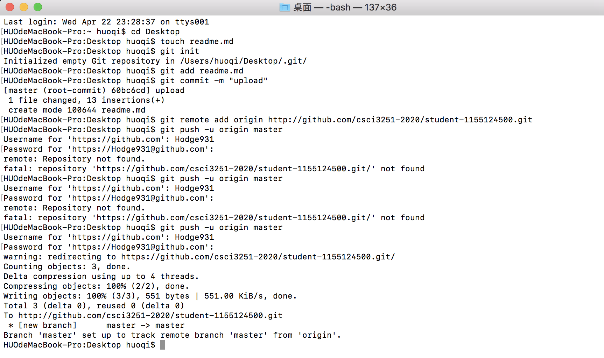

# A brief introduction
## Personal information
- English Name: **Hodge**
- Institute: The Chinese University of Hong Kong
- habits: Play badminton
## courses to take in future
- [x] operating system, CSCI3150
- [x] principles of programming language, CSCI3180
- [ ] Statistics, ECON2121, still condiering

|        Age 6         |             Age 12         |           Age 18          |
| -------------------- | -------------------------- | ------------------------- |
| do not like reading  |   find reading acceptable  |        love reading       |
| do not like exercise | find badminton interesting | happily playing badminton |

